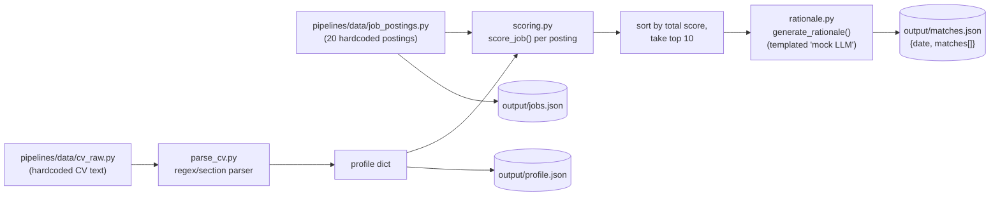
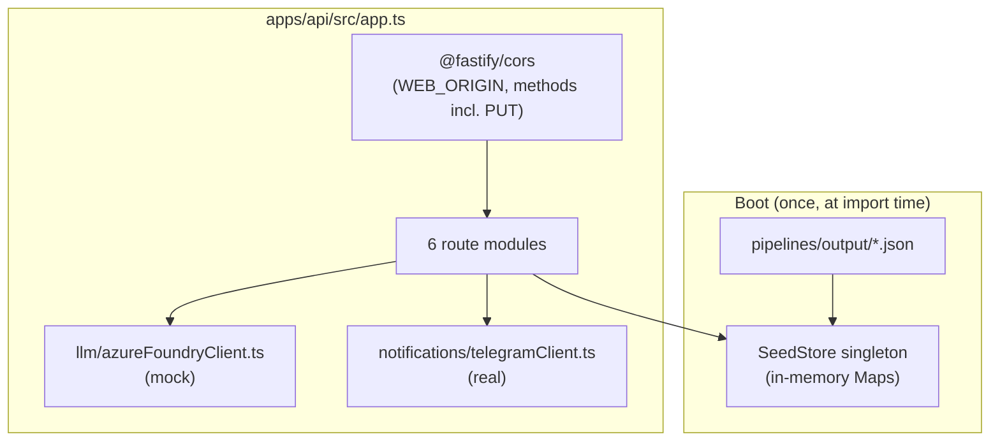

# JobMatch — Architecture

JobMatch is a **static, self-contained demo** of an AI-powered job-matching platform. A Python
pipeline deterministically parses one seeded candidate's CV, scores it against ~20 fictional job
postings, and writes the result to JSON. A Node/Fastify API loads that JSON into memory and serves
it to a React (TanStack Start) frontend. There is no database, no live scraping, and no real LLM
call anywhere in the running system — every "AI" step (CV parsing, rationale generation) is a
deterministic, documented mock that stands in for a described (but unbuilt) Azure-based production
architecture. The one integration that *is* real is an optional Telegram bot that sends a daily
match summary.

This document describes the system **as it actually runs today**. The aspirational production
architecture is summarized separately in [§10](#10-production-target-vs-todays-demo) for context.

## Table of contents

1. [Repo layout](#1-repo-layout)
2. [Tech stack](#2-tech-stack)
3. [Monorepo structure & build order](#3-monorepo-structure--build-order)
4. [Data pipeline (`pipelines/`)](#4-data-pipeline-pipelines)
5. [Shared type layer (`packages/shared`)](#5-shared-type-layer-packagesshared)
6. [Backend API (`apps/api`)](#6-backend-api-appsapi)
7. [Frontend (`apps/web`)](#7-frontend-appsweb)
8. [Features](#8-features)
9. [End-to-end data flows](#9-end-to-end-data-flows)
10. [Production target vs. today's demo](#10-production-target-vs-todays-demo)
11. [Environment variables](#11-environment-variables)
12. [Build, dev & CI tooling](#12-build-dev--ci-tooling)
13. [Known limitations](#13-known-limitations)

---

## 1. Repo layout

```
jobmatch/
├── apps/
│   ├── api/                 # Fastify REST API (Node, TypeScript)
│   └── web/                 # React frontend (TanStack Start)
├── packages/
│   └── shared/               # Zod schemas + inferred TS types, shared by api & web
├── pipelines/                # Python batch pipeline: CV parsing, scoring, rationale, seed data
│   ├── data/                 # Hardcoded demo inputs (CV text, job postings)
│   ├── matching/              # parse_cv.py, scoring.py, rationale.py
│   ├── output/                # Generated seed JSON (gitignored, regenerate with `npm run pipelines:seed`)
│   └── tests/                 # Python unit tests (scoring)
├── package.json               # npm workspaces root
├── tsconfig.json / tsconfig.base.json
├── .oxlintrc.json
└── README.md                   # Project pitch + full production-target design
```

## 2. Tech stack

| Layer | Technology |
|---|---|
| Frontend framework | React 19 + [TanStack Start](https://tanstack.com/start) (SSR) + [TanStack Router](https://tanstack.com/router) (file-based routing) |
| Frontend build | Vite 8 |
| Frontend styling | Hand-rolled CSS Modules + one global stylesheet of CSS custom properties (no component library, no Tailwind) |
| Frontend data layer | A thin `fetch` + [Zod](https://zod.dev/) wrapper (`apiClient.ts`) + route `loader`s + local `useState` — **no react-query/redux/zustand** |
| Backend framework | [Fastify 5](https://fastify.dev/) + `fastify-type-provider-zod` |
| Backend data store | **In-memory only** — a singleton class hydrated once at boot from generated JSON files; no database |
| Validation / schema | [Zod 4](https://zod.dev/), defined once in `packages/shared` and used identically on both the API and the web client |
| Data pipeline | Python 3.10+, standard library only (no third-party deps — see `pipelines/requirements.txt`) |
| Language / tooling | TypeScript ~7 (project references / `tsc -b`), npm workspaces, `oxlint`, `concurrently`, `tsx` (API dev server), `tsr` (route-tree codegen) |
| Real external integration | Telegram Bot API (daily match summary) |
| Mocked external integration | "Azure AI Foundry" LLM client (CV field extraction, match rationale) — pure templating today, with a documented real-integration point |

## 3. Monorepo structure & build order

npm workspaces: `apps/*` and `packages/*`, tied together with TypeScript project references.

- **`packages/shared`** is the single source of truth for every domain type (`Profile`, `JobPosting`,
  `Match`, request/response envelopes). It's a small library with `main`/`types` pointing at a built
  `dist/`, so both `apps/api` and `apps/web` depend on `@jobmatch/shared: "*"` and import the
  **built** package, not source — hence the root `predev` script builds `packages/shared` before
  anything else starts.
- **`apps/api`** and **`apps/web`** both declare a TS project reference to `packages/shared`.
  `apps/api` uses `tsc -b` for a real compiled build (`dist/`, run via plain `node`). `apps/web`
  uses Vite/Bundler module resolution and never emits via `tsc` — `apps/web`'s `typecheck` is a
  separate `tsc --noEmit` invocation, which is why the root `typecheck` script runs `tsc -b`
  (shared + api) *and then* `npm run typecheck -w apps/web` as a second step.
- Root scripts (`package.json`):

  | Script | What it does |
  |---|---|
  | `predev` | `npm run build -w packages/shared` (npm pre-hook, always runs before `dev`) |
  | `dev` | `concurrently` runs `apps/api` (`:4000`) and `apps/web` (`:3000`) dev servers together |
  | `build` | `packages/shared` → `apps/api` → `apps/web`, in that order |
  | `typecheck` | `tsc -b` (shared + api, composite/incremental) then `apps/web`'s own `tsc --noEmit` |
  | `lint` | `oxlint .` (repo-wide; see `.oxlintrc.json` — `react`, `typescript`, `oxc` plugins) |
  | `pipelines:seed` | `python3 pipelines/generate_demo_data.py` — (re)generates `pipelines/output/*.json` |
  | `pipelines:test` | `python3 -m unittest discover -s pipelines/tests -t .` |

  No CI workflow exists in the repo (no `.github/workflows`) — these scripts are run locally / would
  need to be wired into CI separately.

## 4. Data pipeline (`pipelines/`)

Pure Python 3 standard library, run once via `npm run pipelines:seed` (or directly:
`python3 pipelines/generate_demo_data.py`). No CLI args — all demo inputs are hardcoded constants.



### `generate_demo_data.py` — orchestration

1. `build_profile()` — calls `parse_cv(CV_TEXT)`, then attaches `id: "profile-john-doe"` and a `cv`
   envelope (`fileName`, `uploadedAt`, `rawText`).
2. `build_matches(profile)` — for each of the 20 job postings, calls `score_job(profile, job)`,
   sorts all 20 by total score descending, keeps the **top 10** (`TOP_N`), and for each calls
   `generate_rationale(profile, job, result)` to produce the final match object:
   `{jobId, profileId, score, scoreBreakdown, rank, rationale}`.
3. Writes three files to `pipelines/output/` (gitignored, regenerated on demand):
   - `profile.json` — the full seeded candidate profile.
   - `jobs.json` — all 20 raw job postings (unfiltered).
   - `matches.json` — `{date: <today's ISO date>, matches: [...]}` (only the top 10).

These three files are exactly what `apps/api`'s in-memory store reads at boot (§6).

### `matching/parse_cv.py` — CV parsing

Regex/section-based, **no LLM involved by design**. Section headers are detected via
`^([A-Z][A-Z ]+):\s*$` (e.g. `EDUCATION:`); text between headers is sliced into a
`{sectionName: body}` dict.

- **Header block** (before `SUMMARY:`): line 0 = name, line 1 = headline, following lines matched
  against a `Location | email | phone` pattern and a links line (`linkedin.com`/`github.com`
  detection → `links.linkedin`/`links.github`).
- **`EDUCATION`**: each line matched as `degree, institution, startYear-endYear`; degree is split
  into `degree` (e.g. "M.S.") + `field`.
- **`EXPERIENCE`**: each line matched as `title, company, location, YYYY-MM to (Present|YYYY-MM)`;
  lines starting with `-` become `highlights` bullets under the current entry.
- **`SKILLS`**: joined and comma-split into a flat list, casing/order preserved as authored.

Output: `{name, headline, email, phone, location, links, education[], experience[], skills[]}`
(no `id`/`cv` — those are attached by the caller). This logic is **ported line-for-line into
TypeScript** as `apps/api/src/cv/parseCv.ts`, used live by `POST /api/cv/parse-preview` so the
Node API never has to shell out to Python.

### `matching/scoring.py` — scoring algorithm

Fully deterministic, no LLM. `score_job(profile, job)` → four sub-scores in `[0, 1]`, combined into
a weighted total:

| Sub-score | Weight | How it's computed |
|---|---|---|
| **Skill overlap** | **0.50** | `\|profile_skills ∩ job_skills\| / \|job_skills\|` (case-insensitive; recall against the job's required skills, not Jaccard). `0.0` if the job lists no required skills. |
| **Title similarity** | **0.20** | `difflib.SequenceMatcher(None, candidate_title, job_title).ratio()` — character-level sequence match (not token overlap) between the candidate's most recent job title (or headline, if no experience) and the posting's title. |
| **Seniority fit** | **0.15** | Candidate seniority inferred from title keywords (`staff`/`principal`, `senior`/`sr.`, `junior`/`jr.`) or, failing that, years-of-experience thresholds (`junior`≥0, `mid`≥2, `senior`≥5, `staff`≥8). Fit = `1 − ordinal_distance / 3` between candidate and job seniority on the `[junior, mid, senior, staff]` scale. |
| **Experience-years fit** | **0.15** | Years summed across all experience entries (open-ended entries use today's date). If years meet the job's seniority-implied minimum: `max(0.5, 1 − overshoot/20)` (mild over-qualification penalty). If short: `max(0, 1 − shortfall/max(required, 1))`. |

`total = Σ(sub_score × weight)`, rounded to 4 decimals. Scoring and rationale generation are
deliberately kept separate so rationale can later be swapped for a real LLM call without touching
this math.

### `matching/rationale.py` — the "mock LLM" step

Explicitly labeled as a mock. `generate_rationale(profile, job, score)` builds 2–3 sentences by
string concatenation — no model call:

1. **Strength tier** from `total`: **≥0.75 → "a strong match"**, **≥0.5 → "a solid match"**,
   else **"a partial match"**. → *"This role is {strength} for {first_name} ({pct}% overall fit)."*
2. Shared skills (case-insensitive intersection, up to 4 listed) → *"Shared skills with {title} at
   {company} include {skills}."* (or a "no directly overlapping skills" variant).
3. From `seniority_fit`: **≥0.99 → "aligns well"**, **≥0.6 → "roughly in range"**, else
   **"differs notably"**.

The Node-side equivalent (`apps/api/src/llm/azureFoundryClient.ts`) reimplements the same
0.75/0.5 strength tiers but only produces sentences 1–2 plus a fixed "regenerated via mock client"
suffix — it drops the seniority sentence. This is what powers the **"Regenerate"** button on the
job detail page.

## 5. Shared type layer (`packages/shared`)

Every domain schema is defined once as a Zod schema (with the TS type inferred via `z.infer<...>`)
and re-exported from `packages/shared/src/index.ts`. Both the API (server-side validation and
response serialization) and the web client (`apiClient.ts` parses every response through the same
schema) import from here — there is exactly one definition of each shape in the whole system.

| File | Models |
|---|---|
| `profile.ts` | `Education`, `Experience`, `Cv` (raw-text envelope), `Profile`, `UpdateProfileRequest` (partial, omits `id`/`cv`) |
| `job.ts` | `SeniorityLevel` (`junior/mid/senior/staff`), `EmploymentType`, `WorkplaceType` (`remote/hybrid/onsite`), `SalaryRange`, `JobPosting` |
| `match.ts` | `ScoreBreakdown`, `MatchFeedbackStatus` (`none/saved/dismissed`), `Match`, `MatchWithJob` (`Match` + embedded `job`) |
| `api.ts` | Request/response envelopes per endpoint: `GetMatchesResponse`, `CvParsePreviewRequest/Response`, `RegenerateRationaleResponse`, `SetMatchFeedbackRequest/Response`, `TelegramSummaryRequest/Response`, `ErrorResponse` |

## 6. Backend API (`apps/api`)

Fastify 5 + `fastify-type-provider-zod`, so every route's `params`/`body`/`response` schema is a
Zod schema from `packages/shared`, validated automatically and used to generate accurate TS types
for the handler.



- **`app.ts`** — builds the Fastify instance (`logger: true`, Zod validator/serializer compilers),
  registers CORS, then all six route modules.
- **`server.ts`** — calls `buildApp()`, listens on `process.env.PORT ?? 4000`, host `0.0.0.0`.
- **`plugins/cors.ts`** — `origin: WEB_ORIGIN ?? 'http://localhost:3000'`,
  `methods: ['GET','HEAD','POST','PUT']` (explicit `PUT` is required — `@fastify/cors`'s own
  default method list is only `GET,HEAD,POST`, which would silently block every `PUT` request,
  including profile edits and match feedback, via CORS preflight).
- **`data/seedStore.ts`** — the entire data layer. A `SeedStore` singleton is constructed **once**
  at import time: it resolves `pipelines/output/` (four directories up from `apps/api/src/data`),
  reads and Zod-validates `jobs.json`/`profile.json`/`matches.json`, and throws a clear
  "run `npm run pipelines:seed` first" error if they're missing. It joins each match with its job
  into `MatchWithJob` and holds everything in plain `Map`s — **there is no database**, and mutations
  (`updateProfile`, `setMatchFeedback`) just reassign in-memory fields. All state resets on API
  restart.

### Routes

| Method | Path | Behavior |
|---|---|---|
| `GET` | `/api/profile` | Returns the current in-memory profile |
| `PUT` | `/api/profile` | Patches profile (partial, excludes `id`/`cv`); in-memory only |
| `GET` | `/api/jobs/:id` | Single job lookup; `404` if unknown |
| `GET` | `/api/matches` | Today's ranked match list — `{date, matches[]}` |
| `GET` | `/api/matches/:jobId` | Single match + embedded job; `404` if unknown |
| `PUT` | `/api/matches/:jobId/feedback` | Body `{status: 'none'\|'saved'\|'dismissed'}`; `404` if unknown |
| `POST` | `/api/matches/:jobId/rationale/regenerate` | Calls the mock LLM client; returns `{rationale, generatedBy: 'mock-azure-ai-foundry'}`; `404` if unknown |
| `POST` | `/api/cv/parse-preview` | Body `{rawText}`; runs `parseCv` (TS port), returns `{extracted: <partial profile>}` — preview only, nothing persisted |
| `POST` | `/api/notifications/telegram-summary` | Body `{date, jobIds[1–50], filterSummary}`; sends an HTML-formatted Telegram message; `400` if no jobIds resolve, `503` if Telegram isn't configured, `502` on a Telegram API error, else `{sent: true, matchCount}` |

### `llm/azureFoundryClient.ts` — mocked, by design

`mockAzureFoundryClient` (exported as `llmClient`) is the **only** implementation wired up — it
makes no network calls and needs no credentials. `extractCvFields` just delegates to the local
`parseCv`; `generateMatchRationale` reimplements the Python rationale templating (§4). A large
comment block marks the **"REAL INTEGRATION POINT"**: a production version would call Azure AI
Foundry via `@azure/ai-inference` (or an OpenAI-compatible client), gated behind
`USE_REAL_AZURE_LLM=true`, using `AZURE_AI_FOUNDRY_ENDPOINT` / `_API_KEY` / `_DEPLOYMENT_NAME` /
`_API_VERSION`. **None of those Azure env vars are actually read anywhere in the code** — they
exist purely as documentation / `.env.example` entries for the described-but-unbuilt real path.

### `notifications/telegramClient.ts` — real integration

The one genuinely live external call in the system. `sendTelegramMessage(text)` reads
`TELEGRAM_BOT_TOKEN` / `TELEGRAM_CHAT_ID` from the environment (throws
`TelegramNotConfiguredError` if either is missing) and `POST`s to
`https://api.telegram.org/bot<token>/sendMessage` with
`{chat_id, text, parse_mode: 'HTML', disable_web_page_preview: true}`. A non-OK response or
`{ok: false}` body throws `TelegramApiError` with Telegram's own `description`, surfaced by the
route handler as a `502`.

## 7. Frontend (`apps/web`)

React 19 on **TanStack Start** (SSR) with **TanStack Router**'s file-based routing. Built with
Vite 8. No component library — every visual component has a co-located CSS Module
(`*.module.css`); one global stylesheet defines design tokens as CSS custom properties.

### Routing

Routes live under `apps/web/src/routes/`; `routeTree.gen.ts` (generated, gitignored, via `tsr
generate`) wires them into `router.tsx` (`scrollRestoration: true`, `defaultPreload: 'intent'`).

| Route file | URL | Loader | Renders |
|---|---|---|---|
| `__root.tsx` | *(layout)* | — | `<html>` shell, `<Nav>`, global CSS link |
| `index.tsx` | `/` | — | Immediate `redirect` to `/matches` |
| `matches/index.tsx` | `/matches` | `apiClient.getTodayMatches()` | Filterable match list (`JobPreviewCard`, `MatchFilterBar`, `TelegramSummaryButton`) |
| `matches/$jobId.tsx` | `/matches/:jobId` | `apiClient.getMatch(jobId)` (→ `notFound()` on error) | `JobDetailPanel` |
| `profile.tsx` | `/profile` | `apiClient.getProfile()` | `ProfileForm`, `CvUploadCard`, `ExperienceTimeline`, `EducationList`, `SkillsChips` |

### Components (`apps/web/src/components/`)

| Group | Component | Role |
|---|---|---|
| `layout/` | `Nav.tsx` | Top nav bar, active-link styling via TanStack Router |
| `matches/` | `JobPreviewCard.tsx` | List-item card; rank, title, `ScoreBadge`, tags, rationale, Save/Dismiss buttons |
| `matches/` | `MatchFilterBar.tsx` | Salary/Experience/Work-model/Match-tier dropdowns + Saved/Show-dismissed toggle pills + Clear-all, laid out as a fixed CSS grid |
| `matches/` | `MultiSelectDropdown.tsx` | Generic checkbox-list dropdown (outside-click / Escape to close) |
| `matches/` | `ScoreBadge.tsx` | `{pct}% match` badge, tiered styling (strong ≥75%, solid ≥50%, else partial) |
| `matches/` | `TelegramSummaryButton.tsx` | Sends the currently filtered list via `apiClient.sendTelegramSummary` |
| `job/` | `JobDetailPanel.tsx` | Full job detail: header, apply link, Save/Dismiss, rationale box + Regenerate, description/requirements sections |
| `profile/` | `ProfileForm.tsx` | Editable profile form; keyed on loaded fields so a save + reload remounts cleanly |
| `profile/` | `CvUploadCard.tsx` | `.txt` upload → `parseCvPreview` → extracted-fields preview → Apply/Discard |
| `profile/` | `ExperienceTimeline.tsx`, `EducationList.tsx`, `SkillsChips.tsx` | Read-only display of profile sub-sections |
| `shared/` | `Skeleton.tsx` | Generic loading placeholder |
| `icons/` | `TelegramIcon.tsx` | Inline hand-rolled SVG |

### `apps/web/src/lib/`

- **`apiClient.ts`** — the entire data layer. `BASE_URL` from `VITE_API_URL` (fallback
  `http://localhost:4000`). An internal `request<T>(path, schema, init)` does the `fetch`, throws a
  descriptive `Error` on non-OK responses, and otherwise runs the body through `schema.parse(...)`
  — the sole runtime validation point on the client. Exports one `apiClient` object with all nine
  methods matching the route table in §6.
- **`matchFilters.ts`** — pure, dependency-free client-side filtering (documented as never
  triggering a network request): `MatchFilterState`, `createEmptyFilterState`, `isFilterActive`,
  `activeFilterCount`, `countByFeedback`, tier/quartile bucketing helpers
  (`matchTierOf`, `computeSalaryBreakpoints`, `salaryQuartileOf`), option builders for each
  dropdown, `describeActiveFilters` (feeds the Telegram message text), and `applyFilters` (the
  combined predicate).

### Styling

CSS Modules everywhere, plus `apps/web/src/styles/global.css` for tokens (linked via `?url` import
in `__root.tsx`):

- **Colors**: `--color-bg`, `--color-surface`, `--color-border`, `--color-text{,-muted,-faint}`,
  `--color-accent{,-hover,-soft}`, `--color-success{,-soft}`, `--color-warning{,-soft}`,
  `--color-danger`
- **Radii**: `--radius-sm` (6px), `--radius-md` (10px), `--radius-lg` (16px)
- **Shadows**: `--shadow-sm`, `--shadow-md`
- Two global utility classes used directly (not as CSS Modules): `.page` and `.pageHeader`

### Data flow pattern

**No react-query / redux / zustand.** Two patterns only:

- **Reads**: each route's `loader` calls exactly one `apiClient.*` method; the component reads it
  via `Route.useLoaderData()`. A `pendingComponent` (built from `Skeleton`) covers the loading
  state; `matches/$jobId.tsx` also defines a `notFoundComponent`. Loader data is frequently copied
  into local `useState` on first render so it can be mutated locally afterward without a refetch
  (e.g. `matches/index.tsx`: `const [matches, setMatches] = useState(loadedMatches)`).
- **Writes**: local state + a direct `apiClient` call inside an event handler — no shared
  cache/store. Most writes (save/dismiss, regenerate rationale) just update local component state
  afterward. The one exception is `profile.tsx`: after `apiClient.updateProfile`, it explicitly
  calls `router.invalidate()` to force the loader to re-run and refresh `Route.useLoaderData()`,
  and `ProfileForm` is re-keyed on the resulting fields to reset its edit buffer cleanly.

## 8. Features

| Feature | Where | Notes |
|---|---|---|
| **Daily ranked matches** | `/matches` | Top-10 pre-computed matches for the one seeded profile; date is fixed at seed time, not "today" dynamically |
| **Client-side filtering** | `/matches` (`MatchFilterBar`) | Salary quartile, seniority, work model, match tier — all pure re-slicing of the already-fetched array, zero extra requests |
| **Match feedback (save / dismiss)** | `JobPreviewCard`, `JobDetailPanel`, `MatchFilterBar` | Tri-state (`none/saved/dismissed`) per match, persisted server-side in `SeedStore` (in-memory, resets on restart). Dismissed matches are hidden from the list by default with a "Show dismissed (N)" reveal toggle; "Saved" is a narrowing filter. The filter bar is a fixed-column CSS grid — every control (including conditionally-enabled ones) stays permanently mounted so toggling feedback never reflows sibling controls. |
| **Job detail + rationale regenerate** | `/matches/:jobId` | Full posting detail; "Regenerate" re-runs the mock rationale template (not a real model call) |
| **Profile management** | `/profile` | Edit contact/basic fields; in-memory only, resets on API restart |
| **CV upload preview** | `/profile` (`CvUploadCard`) | Upload a `.txt` file → parsed via the same regex logic as the Python pipeline → preview extracted fields → apply (PUT profile) or discard. Nothing is persisted to disk; there's no CV file storage |
| **Telegram daily summary** | `/matches` (`TelegramSummaryButton`) | The one real external integration — sends the *currently filtered* match list as an HTML-formatted Telegram message. Requires `TELEGRAM_BOT_TOKEN`/`TELEGRAM_CHAT_ID`; the UI surfaces a clear "not configured" error otherwise rather than failing silently |

## 9. End-to-end data flows

**Seeding (one-time, before first `npm run dev`)**

```
python3 pipelines/generate_demo_data.py
  → parse_cv.py (hardcoded CV text → profile fields)
  → scoring.py × 20 postings → top 10 by score
  → rationale.py → templated "why this match" text
  → writes pipelines/output/{profile,jobs,matches}.json
```

**API boot**

```
apps/api starts → seedStore.ts imported → reads + Zod-validates the 3 JSON files
  → held in memory (Maps) for the lifetime of the process
```

**Viewing matches (read path)**

```
browser → GET /matches (SSR route render)
  → matches/index.tsx loader → apiClient.getTodayMatches()
  → GET http://localhost:4000/api/matches → seedStore.getTodayMatches()
  → Zod-validated JSON response → parsed again client-side by apiClient
  → Route.useLoaderData() → copied into local useState
  → MatchFilterBar / JobPreviewCard render from that local array
```

**Saving/dismissing a match (write path)**

```
click "Save" on a JobPreviewCard
  → local pending=true → apiClient.setMatchFeedback(jobId, 'saved')
  → PUT /api/matches/:jobId/feedback {status:'saved'}
  → seedStore.setMatchFeedback() mutates in-memory Match + MatchWithJob
  → {jobId, feedback} returned → local card state updated
  → onFeedbackChange bubbles to matches/index.tsx → its local matches array updated
  → MatchFilterBar counts (saved/dismissed) and applyFilters recompute — no refetch
```

**Sending the Telegram summary**

```
click "Send today's summary"
  → apiClient.sendTelegramSummary({date, jobIds: filteredMatches.map(m=>m.jobId), filterSummary})
  → POST /api/notifications/telegram-summary
  → route resolves jobIds against seedStore, builds an HTML message
  → telegramClient.sendTelegramMessage() → POST to Telegram Bot API
  → {sent:true, matchCount} or a 400/502/503 surfaced as a UI error state
```

## 10. Production target vs. today's demo

The root `README.md` describes, in detail, how this would be built as a real always-on product —
summarized here for context only; **none of this is implemented**:

| Concern | Demo (today) | Described production target |
|---|---|---|
| Job ingestion | ~20 hardcoded postings | Scheduled scraping/ATS ingestion into Blob Storage → normalized into Postgres |
| CV parsing | Regex/section parser (Python + TS port) | Blob upload → Event Grid → Azure AI Foundry LLM extraction |
| Matching | Deterministic weighted scoring | Same heuristics **plus** embeddings (pgvector / Azure AI Search) |
| Rationale | Templated strings | Real Foundry chat-completion calls, cached per match |
| Scheduling | One manual `npm run pipelines:seed` run | Nightly batch (Container Apps Jobs / Durable Functions) |
| Storage | Local JSON + in-memory API state | Postgres+pgvector, Blob, Redis, Service Bus, Key Vault |
| Auth | None | Azure AD, RBAC, managed identities |
| Deployment | Local dev servers | Container Apps / Static Web Apps behind Azure Front Door + APIM |
| Security/PII | Not addressed | Encryption, PII minimization, retention/erasure, network isolation, audit logging |

## 11. Environment variables

| Variable | Used by | Default | Notes |
|---|---|---|---|
| `PORT` | `apps/api/src/server.ts` | `4000` | API listen port |
| `WEB_ORIGIN` | `apps/api/src/plugins/cors.ts` | `http://localhost:3000` | CORS allowed origin — must match wherever the web dev server actually lands |
| `TELEGRAM_BOT_TOKEN` | `apps/api/src/notifications/telegramClient.ts` | *(none — required)* | From @BotFather |
| `TELEGRAM_CHAT_ID` | `apps/api/src/notifications/telegramClient.ts` | *(none — required)* | Target chat; bot must be messaged first |
| `AZURE_AI_FOUNDRY_ENDPOINT` / `_API_KEY` / `_DEPLOYMENT_NAME` / `_API_VERSION` | *(not read anywhere in code)* | — | Documented in `.env.example` for the described-but-unbuilt real LLM path only |
| `USE_REAL_AZURE_LLM` | *(not read anywhere in code)* | `false` | Same — the mock client is always what's wired up, regardless of this flag |
| `VITE_API_URL` | `apps/web/src/lib/apiClient.ts` | `http://localhost:4000` | Base URL the frontend calls the API at |

Copy `apps/api/.env.example` → `apps/api/.env` (and `apps/web/.env.example` → `.env` if needed) to
configure. `.env` files are gitignored; `.env.example` files are checked in.

## 12. Build, dev & CI tooling

- **Local dev**: `npm install` → `npm run pipelines:seed` → `npm run dev` (starts API on `:4000`
  and web on `:3000` together via `concurrently`; `predev` builds `packages/shared` first).
- **Type checking**: `npm run typecheck` (`tsc -b` for shared+api project references, then web's
  own `tsc --noEmit`).
- **Linting**: `npm run lint` → `oxlint .` (rules: `react/rules-of-hooks: error`,
  `react/only-export-components: warn`).
- **Tests**: `npm test -w apps/api` (Node's built-in `node:test`, via `tsx --test`);
  `npm run pipelines:test` (Python `unittest`, covers `scoring.py`).
- **CI**: none configured in this repo — no `.github/workflows` directory exists.

## 13. Known limitations

These are current-state facts, not bugs to be fixed casually — they're intentional demo scope
boundaries documented in the README:

- The API loads seed data **once at boot**; re-running `npm run pipelines:seed` requires an API
  restart to pick up new data.
- Profile edits and match feedback are **in-memory only** — every value resets on API restart.
- There is exactly **one seeded candidate profile** — no auth, no multi-user support.
- CV upload is preview-only; no file is ever persisted to disk or storage.
- The "matches" date is fixed at seed-generation time, not computed as "today" on each request.
